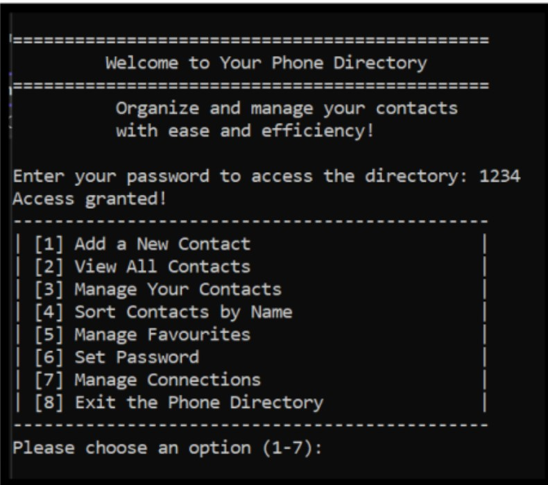
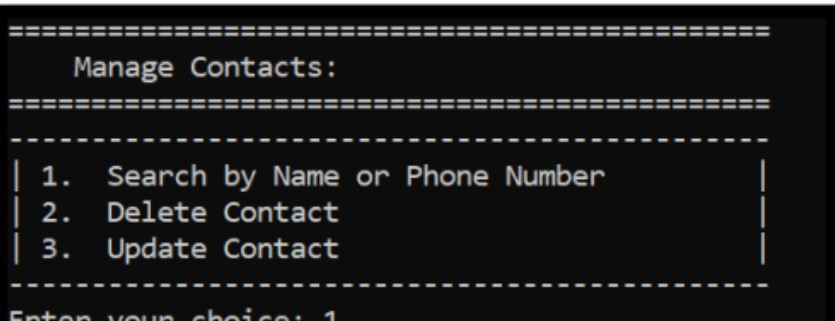
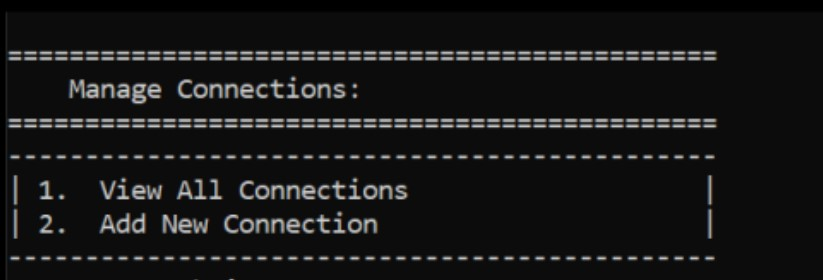

# Telephone Directory 
## Course:Data Structures Project

## 📌 Overview

This project is a **console-based Telephone Directory system** built in
**C++** for the **Data Structures course**.\
It applies **linked lists, graphs, binary search, selection sort, and
file handling** to manage contacts with features like searching,
editing, favorites, and relationships between contacts.

------------------------------------------------------------------------

## ⚙️ Features

-   **Add / View / Edit / Delete contacts**\
-   **Search contacts** using **Binary Search**\
-   **Sort contacts** by name using **Selection Sort**\
-   **Favorites management** (mark/unmark & view favorites)\
-   **Password protection** with limited attempts\
-   **Graph-based connections** (Friend, Family, Colleague, etc.)\
-   **Persistent storage** using text files

------------------------------------------------------------------------

## 🛠️ Technologies

-   Language: **C++**\
-   Concepts:
    -   Doubly Linked List (for contacts)\
    -   Graphs (for relationships)\
    -   File Handling (persistent storage)\
    -   Binary Search (search contacts)\
    -   Selection Sort (sort contacts by name)

------------------------------------------------------------------------

## 🚀 How to Run

1.  Compile and run the project in any **C++ IDE or compiler**.\
2.  On startup, authenticate with the password (default: `1234`).\
3.  Use the menu to:
    -   Add new contacts\
    -   Search, update, or delete contacts\
    -   Manage favorites\
    -   View or add relationships between contacts

------------------------------------------------------------------------

## 📸 Screenshots
### Menu  
\

### Manage Contacts  
\

### Manage Connections  

------------------------------------------------------------------------

## 🎯 Learning Outcomes

-   Implementing **linked lists & graphs** in real-world scenarios\
-   Using **file handling** for data persistence\
-   Applying **binary search** and **selection sort** in C++\
-   Structuring C++ projects with **classes & functions**

------------------------------------------------------------------------

## ✅ Future Improvements

-   GUI-based interface\
-   Import/export contacts in CSV/JSON\
-   More advanced search filters\
-   Secure password hashing

------------------------------------------------------------------------

👨‍💻 Author: 
- Rabbia Noor
